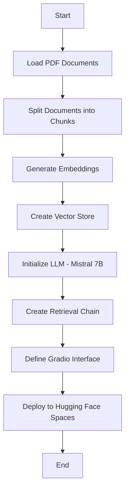

# BioMistral Medical Chatbot

## Description & Key Features
BioMistral Medical Chatbot is an advanced **Retrieval-Augmented Generation (RAG) application** tailored for the medical domain. It leverages state-of-the-art AI models and vector search techniques to provide accurate and insightful answers to medical and biology-related queries.

### Key Technologies Used:
- **Mistral-7B**: A powerful large language model optimized for medical applications, ensuring high accuracy in complex medical queries.
- **ChromaDB**: A high-performance vector database for storing and retrieving high-dimensional embeddings efficiently.
- **PubMed BERT Embeddings**: A specialized medical embeddings model that enhances the chatbot's understanding of medical literature and terminology.
- **Llama.cpp**: Enables **CPU-based inference** for large language models, making the chatbot **cost-effective** without sacrificing performance.
- **LangChain**: An orchestration framework that integrates different components, ensuring smooth operation and **scalability**.
- **Gradio**: Provides a user-friendly web UI for seamless interaction with the chatbot.
- **FastAPI (optional)**: Can be used to extend the chatbot as a **REST API**.

## Workflow


## Installation & Setup
### 1. Clone the Repository
```bash
git clone https://github.com/your-username/BioMistral-Medical-Chatbot.git
cd BioMistral-Medical-Chatbot
```

### 2. Install Dependencies
Ensure you have Python 3.7+ installed.
```bash
pip install -r requirements.txt
```

### 3. Set Up Environment Variables
Export your Hugging Face API Token (if needed):
```bash
export HUGGINGFACEHUB_API_TOKEN="your_token_here"
```

### 4. Run the Chatbot
```bash
python app.py
```

## How It Works
1. Loads medical documents from a directory.
2. Splits them into manageable text chunks.
3. Generates **PubMed BERT embeddings** for each chunk.
4. Stores embeddings in **ChromaDB** for fast retrieval.
5. Uses **Llama.cpp** to run **Mistral-7B** on CPU.
6. Creates a **retrieval chain** to fetch relevant medical information.
7. Provides a **Gradio web interface** for user queries.

## Gradio Interface
The chatbot is accessible via a **simple and modern UI**:
- **Text Input**: Users can enter medical questions.
- **Styled Buttons & Borders**: Enhanced UI/UX with a **responsive layout**.
- **Live Chat Mode**: Instant responses from the AI model.

## Deployment
You can deploy this chatbot on **Hugging Face Spaces**, **AWS**, or **Google Cloud** for public access.

## Future Enhancements
- **Multi-modal support** (Images + Text)
- **Improved Medical Reasoning** using external databases
- **Integration with Electronic Health Records (EHR)**

## License
This project is licensed under the MIT License.

---

### Contributors
- **Your Name** - Developer & Maintainer
- **Contributors Welcome!** Feel free to fork and contribute!

🚀 **Try BioMistral Medical Chatbot today and get expert medical insights at your fingertips!**

